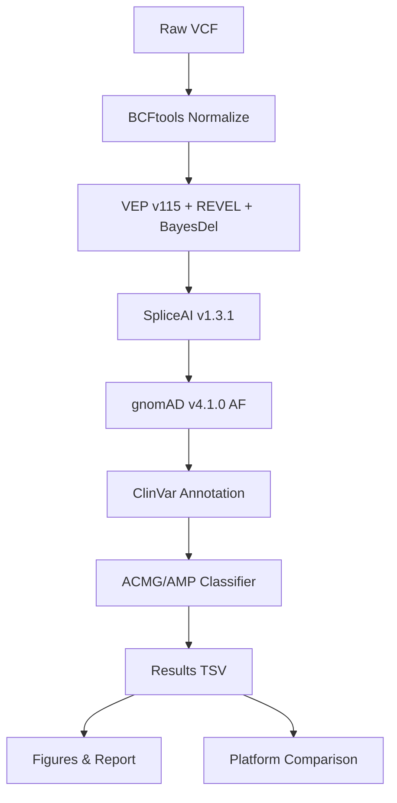

# stk11-peutz-pipeline

[](https://opensource.org/licenses/MIT)
[](https://www.python.org/downloads/release/python-3110/)
[](https://snakemake.readthedocs.io)

**Automated ACMG/AMP Variant Pathogenicity Classification Pipeline for STK11 (Peutz-Jeghers Syndrome)**

**Authors:** Lena Traczuk, Dawid Fleischer

---

## Overview

`stk11-peutz-pipeline` is a fully reproducible, containerized bioinformatics pipeline for the automated classification of variants in the *STK11* gene according to ACMG/AMP guidelines, implementing the Tavtigian Bayesian point framework. The pipeline integrates VEP v115, SpliceAI v1.3.1, gnomAD v4.1.0, and ClinVar for comprehensive variant annotation.

**Disease context:** Peutz-Jeghers syndrome — autosomal dominant disorder with gastrointestinal hamartomatous polyps and elevated cancer risk.

---

## Results Summary

| Metric | Value |
|---|---|
| Total ClinVar Variants Analyzed | **1968** |
| Pathogenic | 0 |
| Likely Pathogenic | **148** |
| VUS | 816 |
| Likely Benign | 66 |
| Benign | 938 |
| Clinically Actionable (P/LP) | **148 (7.5%)** |
| Concordance with Franklin | **65.5%** |
| Data Source | ClinVar GRCh38 (2026-03-21) |

---

## Pipeline Architecture



---

## Quick Start

```bash
# Clone repository
git clone https://github.com/dawidx1233/stk11-peutz-pipeline.git
cd stk11-peutz-pipeline

# Run full pipeline with conda environments
snakemake --use-conda --cores 8

# Or with Docker
docker build -t stk11-peutz-pipeline .
docker run -v $(pwd):/pipeline stk11-peutz-pipeline snakemake --cores 4
```

---

## Repository Structure

```
stk11-peutz-pipeline/
├── Snakefile                          # Main workflow
├── config/config.yaml                 # Gene-specific parameters
├── rules/                             # Snakemake rule modules
│   ├── normalize.smk
│   ├── annotate_vep.smk
│   ├── annotate_spliceai.smk
│   ├── annotate_gnomad.smk
│   ├── annotate_clinvar.smk
│   ├── classify_acmg.smk
│   ├── compare_platforms.smk
│   └── report.smk
├── scripts/                           # Python analysis scripts
│   ├── classify_acmg.py               # Tavtigian Bayesian classifier
│   ├── annotate_gnomad.py
│   ├── annotate_clinvar_and_parse.py
│   ├── compare_platforms.py
│   ├── generate_figures.py
│   └── generate_report.py
├── envs/                              # Conda environments
├── tests/test_pipeline.py             # Unit tests
├── data/STK11_raw.tsv                 # Real ClinVar variants (1968)
├── results/                           # Analysis outputs
│   ├── STK11/classification/
│   ├── STK11/figures/
│   └── comparison/
├── paper/paper.md                     # Manuscript
├── paper/paper.pdf                    # Compiled PDF
├── Dockerfile
├── CITATION.cff
└── LICENSE
```

---

## ACMG/AMP Criteria Implemented

The classifier implements the Tavtigian (2020) Bayesian point system:

| Criterion | Evidence Level | Points | Description |
|---|---|---|---|
| PVS1 | Very Strong Pathogenic | +8 | Null variant (LoF) |
| PS3 | Strong Pathogenic | +4 | Functional studies |
| PM1 | Moderate Pathogenic | +2 | Critical domain (kinase/SARAH) |
| PM2 | Moderate Pathogenic | +1 | Absent from gnomAD |
| PP3 | Supporting Pathogenic | +1 to +2 | In silico (REVEL/SpliceAI) |
| BS1 | Strong Benign | -4 | AF > 0.1% |
| BA1 | Stand-alone Benign | -8 | AF > 5% |

---

## Citation

If you use this pipeline, please cite:

```bibtex
@software{traczuk2026stk11,
  author = {Traczuk, Lena and Fleischer, Dawid},
  title = {stk11-peutz-pipeline: Automated ACMG/AMP Variant Classification for STK11},
  year = {2026},
  url = {https://github.com/dawidx1233/stk11-peutz-pipeline}
}
```
